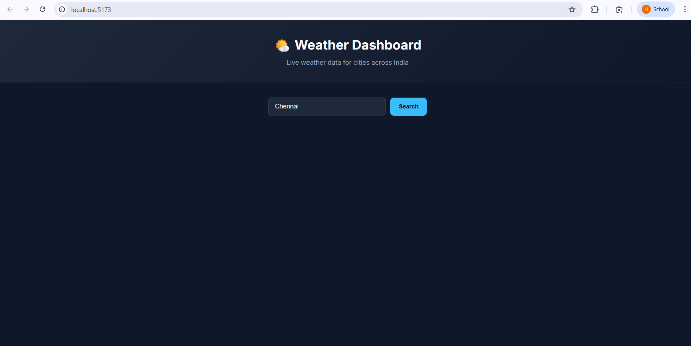
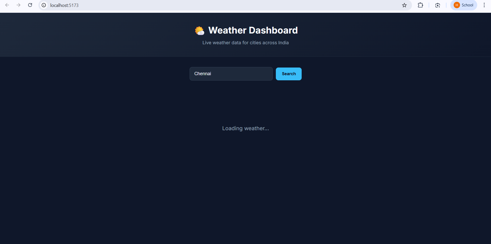
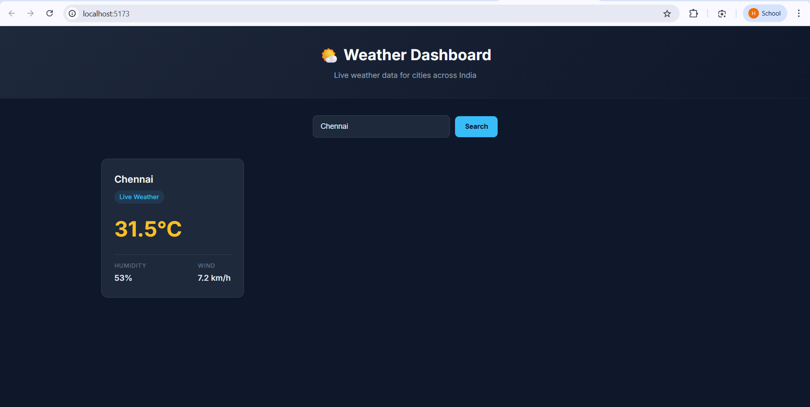

Weather Dashboard – UI Intern Assessment
Project Overview

This project is a Weather Dashboard built as part of the UI Intern assessment.
The application allows users to search for any city and view its current weather information using a public weather API.

The goal of this project is to demonstrate:

Consuming an external API

Building a clean user interface with React

Managing application state

Handling loading and error conditions

Features

Search weather by city name

Displays temperature, humidity, wind speed, and condition

Modern responsive UI

Error handling for invalid cities

Loading indicator while fetching data

Technologies Used

Frontend

React

Vite

JavaScript (ES6)

CSS

API

Open-Meteo Weather API

Libraries

Axios

Project Structure
weather-ui-assessment
│
├── public
│
├── src
│   ├── components
│   │   ├── Header.jsx
│   │   ├── WeatherCard.jsx
│   │   └── WeatherList.jsx
│   │
│   ├── pages
│   │   └── Dashboard.jsx
│   │
│   ├── services
│   │   └── api.js
│   │
│   ├── App.jsx
│   ├── main.jsx
│   └── styles.css
│
├── index.html
├── package.json
└── README.md
How the Application Works

User enters a city name in the search box.

The application calls a weather API.

The API returns current weather data.

The UI displays the information in a weather card.

If the API fails or the city is not found, the application displays a fallback message instead of crashing.

Installation & Setup

Clone the repository:

git clone <your-repository-link>

Navigate to the project folder:

cd weather-ui-assessment

Install dependencies:

npm install

Start the development server:

npm run dev

Open the application in the browser:

http://localhost:5173
Example Usage

Search for cities such as:

Chennai

Delhi

Mumbai

Bangalore

Coimbatore

The dashboard will display the current weather for the selected city.

API Used

Open-Meteo Weather API
https://open-meteo.com/

Data retrieved:

Temperature

Humidity

Wind Speed

Author

Submitted as part of a UI Internship Assessment.

OUTPUT:

